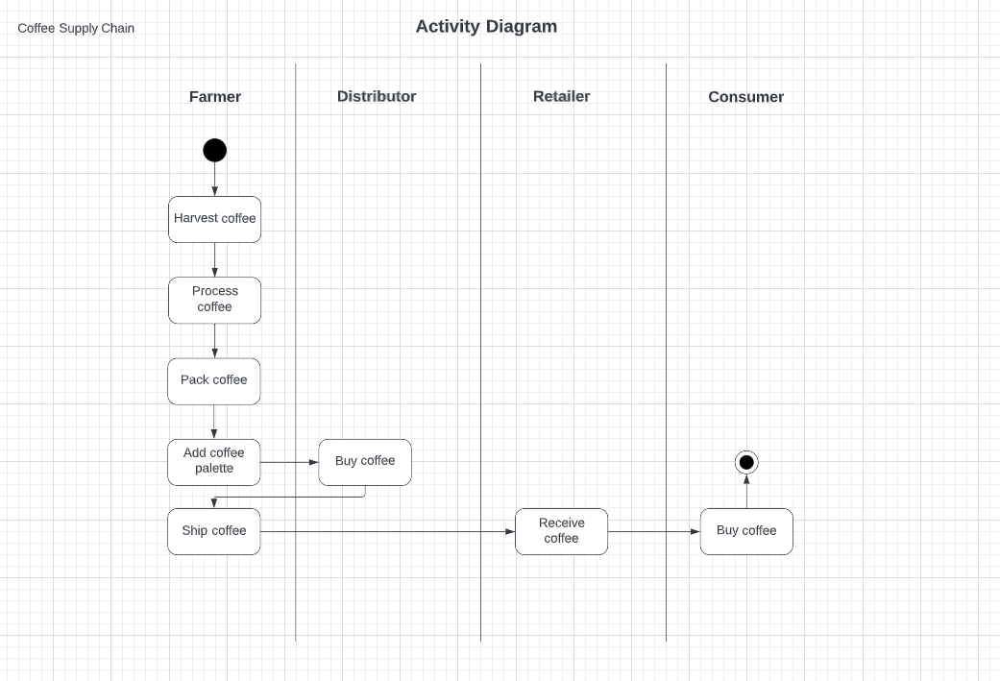
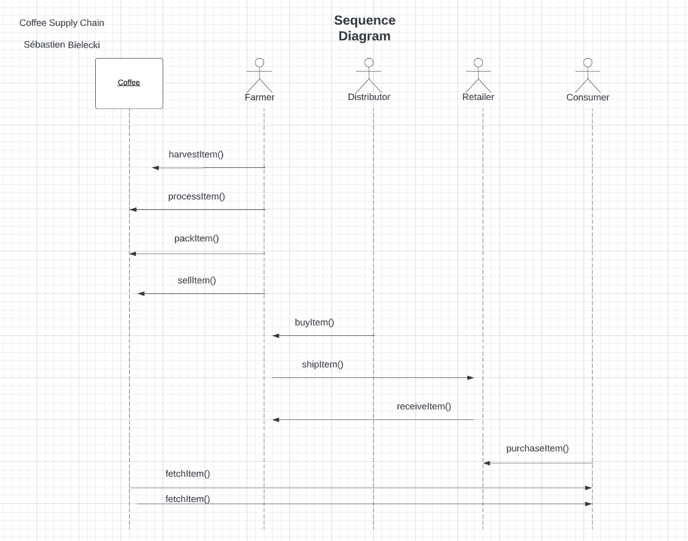
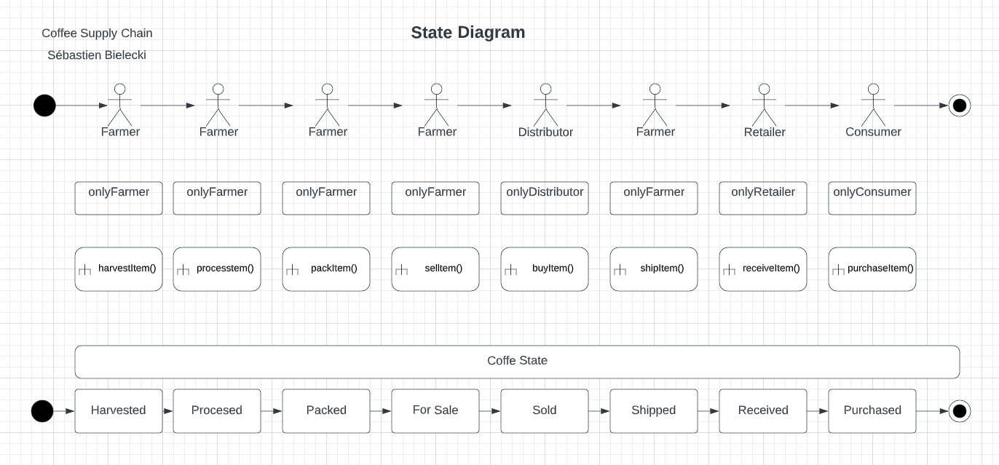
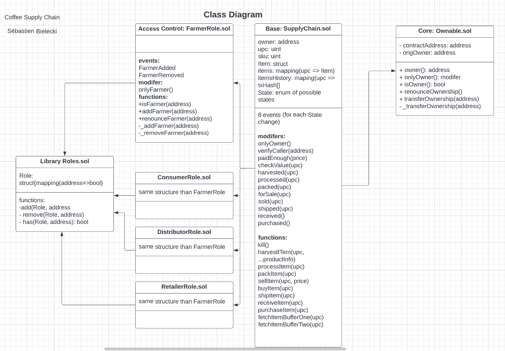

# Coffee-Supply-Chain-Dapp-on-Ethereum

This a dApp implemented on Ethereum with a basic Front End. 
It features the tracking the state of an asset (Coffee) along a Supply Chain composed by 4 actors: Farmer, Distributor, Retailer and Consumer, and we are tracking the information of the asset, such as the origin farm, the farmer Id, distributor Id, retailer Id and Consumer Id.

## Project Unified Modelling Language (UML)

### Activity Diagram

The general process is the following:

### Sequence Diagram

This diagram models the different actions that can do the different actors that generates a change on the asset State.

### State Diagram

This diagrams models the state of the asset depending on where they stand in the supply chain.

### Class Diagram

This diagram models the different smart contracts implemented, with their variables and methods. The architecture is a Base contract called SupplyChain, that inherits from Access Control contracts (FarmerRole, DistributorRole, RetailerRole, ConsumerRole). The access contract access a Library called Roles. The Base contracts also inherint from the Ownable contract, that permits to change the owner of the contract.

## Deployment on Goerli Testnet

The contracts are deployed on Goerli at the following addresses:
 
 
<strong>SupplyChain</strong>
 
Transaction hash: 0x4dbe1f8a53e2f81681ddb29edfbcff5830dccbd852795e25907d8acbd4c8abca
 
Smart Contract Address: 0x9A052652d5bf27daB4b5f633CD895e90D849bcfb
 
 
<strong>ConsumerRole</strong>
 
Transaction hash: 0x747dd0f9f595d69ec069958f916f3fd59351c9c7a15ab7fbf45ccf8b8345e015
 
Smart Contract Address:0x9a052652d5bf27dab4b5f633cd895e90d849bcfb
 
 
<strong>RetailerRole</strong>
 
Transaction hash: 0xc1658affd5848eb6d695c8aadf53a21a1ba3aba223d056d8b5ea84cdf3ea95fd
 
Smart Contract Address: 0x34e27066e36e955dcd931bd4e7f89cc55c292a03
 
 
<strong>DistributorRole</strong>
 
Transaction hash: 0xc24d816a479b70648953714ec5fd200ea4bd6a190fcc2900eaf19524a4a27da7
 
Smart Contract Address: 0x89d119223ff74fda495ffeaff1632595bd9a59f4
 
 
<strong>FarmerRole</strong>
 
Transaction hash: 0xb27403565380bd6097ac02ba33efb6af3f6449907d7b35c9e7dd24387a236560
 
Smart Contract Address: 0x09b8bf0cd21b850a98acc669f855de9cf8d9b028
